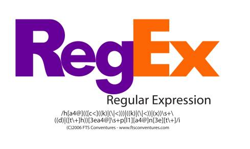

# 正则表达式（Regular Expression）



## 本仓库内容

1. re基本功学习笔记

```
Something I hope you know before go into the coding~
First, please watch or star this repo, I'll be more happy if you follow me.
Bug report, questions and discussion are welcome, you can post an issue or pull a request.
```

## 相关站点

* GitBook:<https://yifengyou.gitbooks.io/learn-re/content/>
* GitHub:<https://github.com/yifengyou/learn-re/>
* GitPage:<https://yifengyou.github.io/learn-re/>


## 目录


EPOCH=$(shell echo $(DESCRIBE)| awk -F':' '{print $$i}' )
UPSTREAM=$(shell echo $(DESCRIBE)| awk -F'-' '{for(i=1;i<NF-1;i++) printf $$i"-"}{print $$i}'  )
DEBIANREVISION=$(shell echo $(DESCRIBE)| awk -F'-' '{print $$NF}'  )


## 小结
